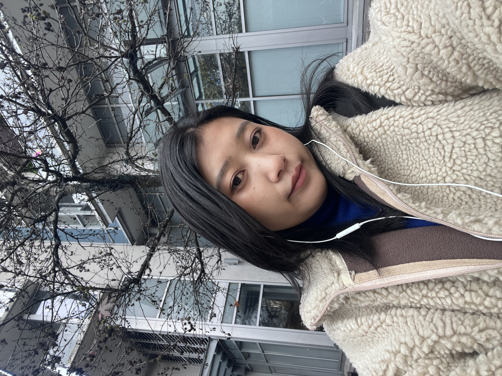

::: {.landing-card}

::: {.columns}
::: {.column width="45%"}
{.landing-photo}
:::

::: {.column width="55%"}
### ABOUT ME

# I’m Tshering Wangmo, an MBA student focused on analytics, operations, and digital transformation.

I have experience across education, sustainability, hospitality, and sales in Bhutan, Thailand, and Canada. My MBA journey is helping me strengthen business analytics, leadership, and decision-making skills.
:::
:::

:::

[Resume](resume.qmd){.btn .btn-outline-secondary}
[Projects](projects.qmd){.btn .btn-outline-secondary}
[Skills](skills.qmd){.btn .btn-outline-secondary}
[Contact](contact.qmd){.btn .btn-outline-secondary}

---

# Welcome

Hi, I’m Tshering Wangmo, an MBA candidate at University Canada West with a background in Sustainable Development and professional experience in education, hospitality, and sales. I’m passionate about sustainability, data-driven decision-making, and entrepreneurship.

This website is my MBA portfolio. It brings together my academic work, professional experience, and personal projects, highlighting how I am developing as a reflective and practice-oriented business leader.

---

## About Me

I have experience in education sector as a teacher, community work accross Bhutan, and presently I am working in food service sector. These experiences helped me build strong communication, organization, and teamwork skills.

Through the MBA, I am especially interested in operations, people-focused management, and practical digital transformation. I want to learn how to use data and simple process improvements to make work more efficient and more humane.

---

## What You Will Find

• *Resume*: Education, work experience, and core competencies.  
• *Projects*: Selected MBA assignments and case studies.  
• *Skills and Certifications*: Business, technical, and interpersonal skills.  
• *Leadership and Community*: Roles where I supported others and took initiative.  
• *Contact*: How to reach me and connect on LinkedIn.

---

## Quick Links

• [Resume](resume.qmd)  
• [Projects](projects.qmd)  
• [Skills](skills.qmd)  
• [Contact](contact.qmd)
